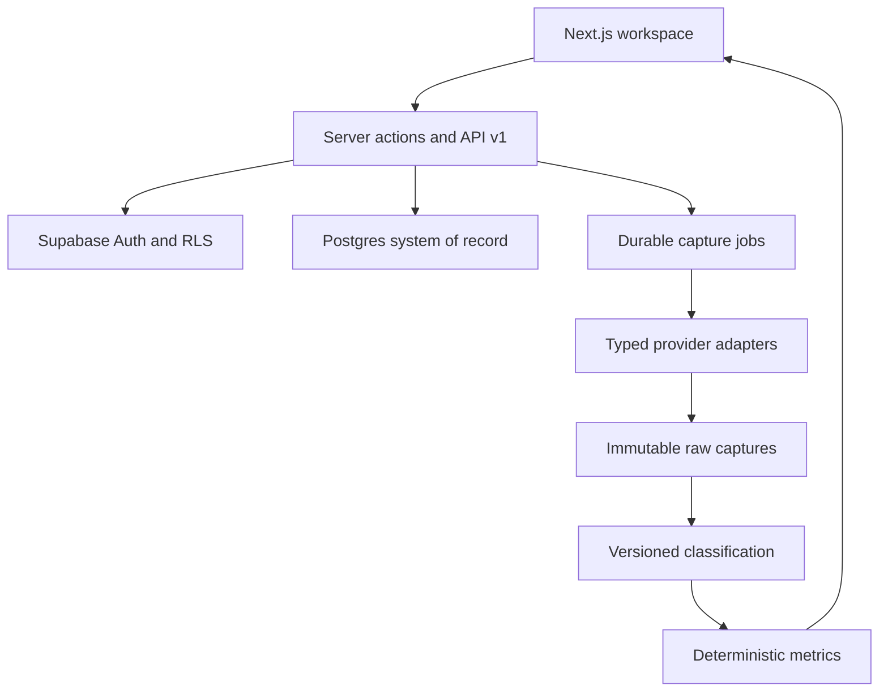

# RefineStack Release 1 architecture and shared contracts

## System shape



## Runtime boundaries

- Next.js App Router Server Components read workspace data directly.
- Server Actions handle authenticated product mutations.
- Route Handlers exist for external API, webhooks, exports and worker execution.
- Provider credentials and service-role access exist only in server-only modules.
- Supabase Postgres is authoritative for tenant data, queue state, idempotency, audit and usage.
- Supabase Storage holds evidence files; database rows retain policy and lineage.
- Raw provider output is immutable. Classification, metrics and actions are replaceable/versioned projections.

## Module ownership

| Area | Owned paths | Must not edit |
|---|---|---|
| Data/security | `supabase/migrations/**`, `src/lib/db/**`, generated database types | UI, provider adapters |
| Runtime/intelligence | `src/lib/ai/**`, `src/lib/metrics/**`, `src/app/api/**`, runtime unit tests | Migrations, UI |
| Product UI | `src/app/(app)/**`, `src/components/**`, app styles and UI tests | Migrations, provider/runtime internals |
| Integration | brand/auth shell, dependencies, shared contracts, CI, end-to-end tests, final conflict resolution | Other modules except required integration fixes |

Shared contracts are changed only by the integration owner after a request from a module owner.

## Core entities

- Identity: profile, workspace, member, invitation, role.
- Configuration: project, brand, competitor, alias, market, persona.
- Questions: question, question version, qualification result, question set.
- Evidence: source, source version, file object, source policy, claim.
- Execution: monitoring run, capture job, observation, citation, usage event, health event.
- Interpretation: classification, classification review, entity event, metric snapshot.
- Improvement: action, action-decision link, annotation.
- Operations: schedule, API token, webhook endpoint, webhook delivery, audit event.

All tenant-owned tables carry `workspace_id` directly unless the row is a strict child of a workspace-owned parent and every access path is proven through that parent. Every exposed table has RLS and explicit grants.

## Role contract

| Capability | Owner | Admin | Analyst | Viewer |
|---|---:|---:|---:|---:|
| Read workspace results | Yes | Yes | Yes | Yes |
| Edit project/questions/evidence | Yes | Yes | Yes | No |
| Start/retry runs | Yes | Yes | Yes | No |
| Review classifications/actions | Yes | Yes | Yes | No |
| Manage members/schedules/webhooks | Yes | Yes | No | No |
| Create API tokens/export restricted data | Yes | No | No | No |
| Delete workspace/transfer ownership | Yes | No | No | No |

## Run state machine

`queued → running → succeeded | partial | failed | cancelled`

Each capture job is `queued → leased → succeeded | failed | unavailable`. A stale lease may return to queued with incremented retry count. Unique idempotency keys prevent duplicate billable work.

Run completion is derived:

- `succeeded`: every requested capture succeeded.
- `partial`: at least one succeeded and at least one failed/unavailable.
- `failed`: no capture succeeded.
- `cancelled`: user cancelled before all work completed.

## Provider contract

```ts
type ProviderCaptureRequest = {
  workspaceId: string;
  projectId: string;
  runId: string;
  jobId: string;
  questionId: string;
  prompt: string;
  locale: string;
  market: string;
  timeoutMs: number;
};

type ProviderCaptureResult = {
  provider: "openai" | "claude" | "google_ai_overview";
  accessMethod: "api" | "search_api";
  modelOrSurface: string;
  providerRequestId?: string;
  answerText: string;
  citations: Array<{ url: string; title?: string; position?: number }>;
  inputTokens?: number;
  outputTokens?: number;
  estimatedCostUsd?: number;
  latencyMs: number;
  capturedAt: string;
  rawResponse: unknown;
};
```

Adapters throw typed unavailable, timeout, rate-limit, authentication, malformed-response and provider errors. No adapter invents a fallback answer.

## Classification contract

Every brand classification stores independent `mentioned`, `cited`, `explicitlyRecommended`, `firstChoice` and `rejected` facts, plus classifier name/version, brand/competitor entity, confidence, rank where applicable, evidence spans, rationale, review state and source observation. The logical implications `firstChoice → explicitlyRecommended → mentioned` are enforced, while citation remains independent. A derived display label may use absent, mentioned, shortlisted, recommended, first choice or rejected, but that label is not the stored truth model. Classification cannot mutate the raw observation.

## API contract

- Base path `/api/v1`.
- Bearer tokens are random, shown once and stored as SHA-256 hashes.
- Every token is workspace-scoped and may have read/run scopes.
- Mutation requests accept `Idempotency-Key`.
- List endpoints use cursor pagination.
- Errors use `{ error: { code, message, requestId, details? } }`.
- Responses never expose provider credentials, service keys, internal prompts or another tenant's identifiers.

## Webhook contract

Events: `run.started`, `run.completed`, `run.partial`, `run.failed`, `review.required`, `action.created`, `action.completed`.

Delivery uses HMAC-SHA256 over `<timestamp>.<raw-body>`, includes event/delivery IDs, has a five-minute tolerance, rejects replay, retries with bounded exponential backoff, and records response status without storing destination credentials in logs.

## Security invariants

- No authorization from user-editable metadata.
- Membership and role are checked on every server mutation and RLS path.
- Service-role calls require an already-authorized workspace context.
- Security-definer functions live in a private schema, set an empty search path, validate the actor or a trusted worker secret, and revoke public execution.
- Uploaded/crawled evidence is untrusted data and cannot change system/tool instructions.
- Secrets never enter client bundles, audit payloads, raw provider prompts, exports or user-visible errors.
- Invitations are email-bound, expiring and single-use.
- Deleting or disconnecting a connector stops future work immediately.

## Reliability and observability

- Structured request/run/job IDs cross UI, API, worker, database and webhook logs.
- All external calls have timeouts and classified errors.
- Retry follows provider guidance and never duplicates a successful capture.
- Preflight estimates call count and known model cost before fan-out.
- Schedules define timezone, overlap policy and failure threshold.
- Repeated failure opens a circuit breaker and alerts an owner.
- Aggregate metrics are deterministic functions covered by unit tests.

## Environment contract

Required platform variables:

- `NEXT_PUBLIC_SUPABASE_URL`
- `NEXT_PUBLIC_SUPABASE_PUBLISHABLE_KEY`
- `SUPABASE_SERVICE_ROLE_KEY`
- `NEXT_PUBLIC_APP_URL`
- `APP_ENCRYPTION_KEY`
- `WORKER_SECRET`
- `WEBHOOK_SIGNING_PEPPER`

At least one provider must be configured for real captures:

- `OPENAI_API_KEY` and optional `OPENAI_MODEL`
- `ANTHROPIC_API_KEY` and optional `ANTHROPIC_MODEL`
- `SERPAPI_API_KEY` for Google AI Overview capture

The application remains usable for configuration and historical inspection when a provider is unavailable, but the preflight gate blocks selecting that provider.
